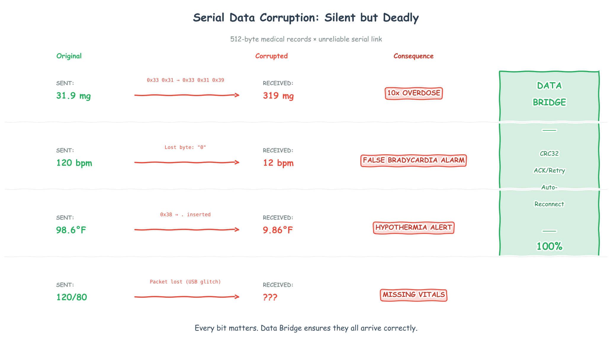

# SafeSerial
[](https://www.npmjs.com/package/@technoculture/safeserial)
[](https://pypi.org/project/safeserial/)

**When `31.9 mg` becomes `319 mg`, patients get hurt.**

Serial communication is unreliable. Bits flip. Packets drop. Cables disconnect. If your embedded system sends medical dosages, sensor readings, or control commands over UART—you need detection and recovery, not hope.

SafeSerial is a reliability layer for serial links. It adds framing, checksums, acknowledgements, and retries so corruption is detected and data can be retried.



## Install

```bash
# Node.js
npm install @technoculture/safeserial

# Python
pip install safeserial
```

## Why SafeSerial

- **CRC32 corruption detection** for framed payloads
- **ACK/Retry** to recover from drops in supported flows
- **Automatic fragmentation/reassembly** for large payloads
- **Resilient reconnect** for unstable links (where supported)
- **Electron-ready** native bindings

## The Problem

Raw serial communication fails silently:

| Sent | Received | Failure Mode |
|------|----------|--------------|
| `31.9 mg` | `319 mg` | Bit flip → 10x overdose |
| `120 bpm` | `12 bpm` | Lost byte → false alarm |
| `98.6°F` | `9.86°F` | Corruption → wrong diagnosis |
| `{"vital":...}` | `(nothing)` | Packet dropped → missing data |

These aren't hypotheticals. This is what happens on noisy links.

## How It Works

```
Your Data → [COBS Framing] → [CRC32] → [ACK/Retry] → [Auto-Reconnect]
```

- **CRC32** detects corruption in framed payloads
- **ACK/Retry** attempts delivery and reports failure on retry limits
- **Auto-Reconnect** restores sessions after disconnects when possible

This doesn’t eliminate all failure modes, but it turns silent corruption into detected errors and adds recovery for common link failures.

## Protocol (Plain English)

Serial gives you a **stream of bytes**, not “messages”. The protocol in this repo turns that stream into packets you can (a) split, (b) validate, and (c) retry.

**COBS framing (where packets start/end)**  
This repo uses `0x00` as the delimiter. COBS encodes each packet so `0x00` **never appears inside** the encoded packet, then appends a single `0x00` at the end.

```cpp
// include/safeserial/protocol/packet.hpp
static constexpr uint8_t COBS_DELIMITER = 0x00;
```

So the wire looks like:

```
[encoded packet bytes ... no 0x00] 0x00 [encoded packet bytes ... no 0x00] 0x00 ...
```

If noise drops/inserts bytes, you can discard the broken chunk and resynchronize at the next delimiter. (COBS is not encryption or error-correction; it’s just a reliable “packet boundary” trick.)

**CRC32 (is this packet intact?)**  
Each packet carries a CRC32 over its contents. The receiver recomputes it; if it doesn’t match, the packet is rejected instead of being used.

**ACK/Retry (did it arrive?)**  
For messages that require delivery, the receiver ACKs valid packets. If the sender doesn’t see an ACK within a timeout, it retries up to a limit and then reports failure.

### Why COBS + CRC32 (not just CRC)

CRC alone can tell you “these bytes are wrong”, but it can’t tell you “these bytes are a whole packet”. Without framing you don’t know where to start/stop computing the CRC, and after corruption you may not know how to get back in sync. COBS solves *packet boundaries*; CRC solves *bit flips*.

### Why CRC32 (not CRC16)

CRC16 is 2 bytes; CRC32 is 4 bytes. CRC32 is used here because it’s a much stronger checksum for catching accidental corruption: roughly **1 in 65,536** random corruptions can slip past CRC16 vs **1 in 4,294,967,296** for CRC32, for the cost of 2 extra bytes per packet.

## Quick Start

**C++:**
```cpp
#include <safeserial/protocol/packet.hpp>

auto packet = Packet::serialize(Packet::TYPE_DATA, seq++, sensor_json);
serial.write(packet);  // Automatic retry until ACK received
```

**TypeScript/Electron:**
```typescript
import { ResilientDataBridge } from '@technoculture/safeserial';

const bridge = await ResilientDataBridge.open('/dev/ttyUSB0');

// Retries until ack or failure; disconnects queue until reconnect when possible
await bridge.send('{"dose": 31.9, "unit": "mg"}');

bridge.on('disconnect', () => console.log('Queuing messages...'));
bridge.on('reconnected', () => console.log('Flushed!'));
```

**Python:**
```python
import safeserial

bridge = safeserial.DataBridge()
bridge.open("/dev/ttyUSB0", 115200, lambda data: print(data))
bridge.send(b'{"dose": 31.9, "unit": "mg"}')
bridge.close()
```

## Building & Verification

We use `bridge.py`, a unified CLI tool for building, testing, and verifying the entire stack.

### 1. Build Everything
Builds C++ core, Python environment, and Node bindings.
```bash
uv run python bridge.py build
```

### Sanitizers (C++ Core)
Enable sanitizers via the `SAFESERIAL_SANITIZERS` env var during configure. Use a semicolon or comma-separated list (Clang/GCC).
```bash
SAFESERIAL_SANITIZERS=address,undefined uv run python bridge.py build
SAFESERIAL_SANITIZERS=thread uv run python bridge.py build
```

### Coverage & Fuzzing
```bash
./scripts/run_coverage.sh
./scripts/run_fuzz.sh
```

### Traceability Artifacts
```bash
python scripts/collect_artifacts.py
```

### Traceability (Requirements → Tests)
Run end-to-end verification, generate test ID links, validate coverage, and capture evidence artifacts:
```bash
uv run python bridge.py test verify
```

What this produces:
- `docs/traceability/generated/traceability_report.md` (coverage + consistency checks)
- `docs/traceability/generated/testid_links.md` (TestID → GTest/pytest linkage)
- `docs/traceability/artifacts/latest/manifest.json` (evidence checksums)

Coverage threshold (default 100%):
```bash
SAFESERIAL_REQ_COVERAGE=1.0 uv run python bridge.py test verify
```

### Traceability Rollup (Submodules)
Aggregate traceability across git submodules:
```bash
uv run python scripts/aggregate_traceability.py
```

### CI
The default CI workflow runs build/unit tests, sanitizers, coverage, and fuzzing on Linux.

## Testing & Verification

The project includes a universal CLI tool `bridge.py` to manage builds and tests.

### 1. Build
```bash
uv run python bridge.py build
```
Builds the C++ core, Node.js bindings (if available), and sets up the Python environment.

### 2. Run Reliability Verification
Automated suite that runs traffic simulation with dropped/corrupted packets (Chaos Monkey).

```bash
# Verify C++ Bindings (Default)
uv run python bridge.py test verify       # Internal call to scripts/verify_reliability.py --target cpp

# Verify Node.js Bindings
uv run python scripts/verify_reliability.py --target node

# Cross-Language Verification (e.g. Node Sender -> Python Receiver)
uv run python scripts/verify_reliability.py --sender node --receiver python
```

### 3. Interactive Chaos Mode
Visualize the connection state and chaos effects in real-time.

```bash
# Default (Python only)
uv run python bridge.py test chaos

# Visualize C++ Agents
uv run --project bindings/python python scripts/chaos_visual.py --sender cpp --receiver cpp --items 100

# Visualize Mixed (Node -> Python) with High Chaos
uv run --project bindings/python python scripts/chaos_visual.py \
    --sender node --receiver python \
    --drop 0.05 --corrupt 0.02 \
    --burst 0.01 --latency 0.02 --disconnect 0.001
```

### 4. Unit Tests
```bash
uv run python bridge.py test unit
```

## Documentation
- **Test Reports**: Generated in `docs/traceability/artifacts/latest/verify_reliability_report.md` after running verification.
- **Walkthrough**: See [walkthrough.md](walkthrough.md) for implementation details.

### 5. Generate Reports
Regenerate plots and reports from previous test runs.
```bash
uv run --with matplotlib python bridge.py viz
```

### 6. Publish
Uploads artifacts to PyPI (via `uv`) and NPM.
```bash
uv run python bridge.py publish      # Publish both
uv run python bridge.py publish python # Publish only Python bindings
```


---

*Built for systems where 99.9% reliability means someone gets hurt.*
