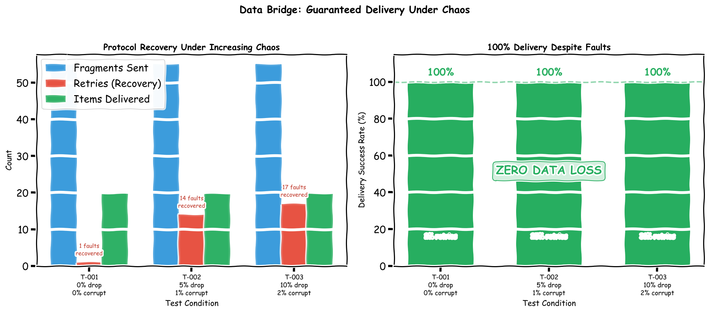

# Test Record - ISO 13485 Compliance
**Project:** Data Bridge Serial Protocol
**Date:** 2026-01-08T23:41:19.075338
**Tester:** Automated Runner

## 1. Scope
Verification of the reliable serial protocol implementation (Class C Medical Device component).

## 2. Test Environment
*   **OS:** darwin
*   **Build Artifacts:** `/Users/satyamtiwary/Documents/Python-Things/data-bridge/build/tests/reliability_test`
*   **Test Driver:** `/Users/satyamtiwary/Documents/Python-Things/data-bridge/scripts/verify_reliability.py`

## 3. Reliability Visualization


## 4. Test Cases & Results

| Test ID | Condition | Items | Result | Verification |
| :--- | :--- | :--- | :--- | :--- |
| T-001 | Drop=0.0%, Corrupt=0.0% | 20 | **PASS** | Data Integrity confirmed via CRC32 |
| T-002 | Drop=5.0%, Corrupt=1.0% | 20 | **PASS** | Data Integrity confirmed via CRC32 |
| T-003 | Drop=10.0%, Corrupt=2.0% | 20 | **PASS** | Data Integrity confirmed via CRC32 |

## 5. Conclusion
**Overall Status:** PASS

The software HAS demonstrated compliance with reliability requirements.

## 4. Execution Logs

### T-001 Details
### Sender Log
```
1767895810.786241: [SENDER] Starting stress test with 20 items...
1767895810.786253: [SENDER] Sending SYN...
1767895810.887406: [SENDER] Rx Type: 32
1767895810.887412: [SENDER] Handshake Complete!
1767895810.887421: [SENDER] Sending Item 0 Frag 0/1
1767895810.887490: [SENDER] Item 0 Verified.
1767895810.887498: [SENDER] Sending Item 1 Frag 0/2
1767895810.887561: [SENDER] Sending Item 1 Frag 1/2
1767895810.887606: [SENDER] Item 1 Verified.
1767895810.887611: [SENDER] Sending Item 2 Frag 0/1
1767895810.887674: [SENDER] Item 2 Verified.
1767895810.887681: [SENDER] Sending Item 3 Frag 0/3
1767895810.887745: [SENDER] Sending Item 3 Frag 1/3
1767895810.887806: [SENDER] Sending Item 3 Frag 2/3
1767895810.887843: [SENDER] Item 3 Verified.
1767895810.887854: [SENDER] Sending Item 4 Frag 0/4
1767895810.887912: [SENDER] Sending Item 4 Frag 1/4
1767895810.887967: [SENDER] Sending Item 4 Frag 2/4
1767895810.888027: [SENDER] Sending Item 4 Frag 3/4
1767895810.888074: [SENDER] Item 4 Verified.
1767895810.888082: [SENDER] Sending Item 5 Frag 0/3
1767895810.888162: [SENDER] Sending Item 5 Frag 1/3
1767895810.888220: [SENDER] Sending Item 5 Frag 2/3
1767895810.888265: [SENDER] Item 5 Verified.
1767895810.888277: [SENDER] Sending Item 6 Frag 0/5
1767895810.888404: [SENDER] Sending Item 6 Frag 1/5
1767895810.888461: [SENDER] Sending Item 6 Frag 2/5
1767895810.888522: [SENDER] Sending Item 6 Frag 3/5
1767895810.888585: [SENDER] Sending Item 6 Frag 4/5
1767895810.888627: [SENDER] Item 6 Verified.
1767895810.888638: [SENDER] Sending Item 7 Frag 0/4
1767895810.888704: [SENDER] Sending Item 7 Frag 1/4
1767895810.888770: [SENDER] Sending Item 7 Frag 2/4
1767895810.888837: [SENDER] Sending Item 7 Frag 3/4
1767895810.888899: [SENDER] Item 7 Verified.
1767895810.888904: [SENDER] Sending Item 8 Frag 0/2
1767895810.888962: [SENDER] Sending Item 8 Frag 1/2
1767895810.889014: [SENDER] Item 8 Verified.
1767895810.889021: [SENDER] Sending Item 9 Frag 0/2
1767895810.889076: [SENDER] Sending Item 9 Frag 1/2
1767895810.889118: [SENDER] Item 9 Verified.
1767895810.889124: [SENDER] Sending Item 10 Frag 0/2
1767895810.889184: [SENDER] Sending Item 10 Frag 1/2
1767895810.889224: [SENDER] Item 10 Verified.
1767895810.889234: [SENDER] Sending Item 11 Frag 0/4
1767895810.889298: [SENDER] Sending Item 11 Frag 1/4
1767895810.889361: [SENDER] Sending Item 11 Frag 2/4
1767895810.889427: [SENDER] Sending Item 11 Frag 3/4
1767895810.889468: [SENDER] Item 11 Verified.
1767895810.889472: [SENDER] Sending Item 12 Frag 0/1
1767895810.889521: [SENDER] Item 12 Verified.
1767895810.889531: [SENDER] Sending Item 13 Frag 0/3
1767895810.889601: [SENDER] Sending Item 13 Frag 1/3
1767895810.889664: [SENDER] Sending Item 13 Frag 2/3
1767895810.889709: [SENDER] Item 13 Verified.
1767895810.889720: [SENDER] Sending Item 14 Frag 0/4
1767895810.889776: [SENDER] Sending Item 14 Frag 1/4
1767895810.889838: [SENDER] Sending Item 14 Frag 2/4
1767895810.889899: [SENDER] Sending Item 14 Frag 3/4
1767895810.889963: [SENDER] Item 14 Verified.
1767895810.889967: [SENDER] Sending Item 15 Frag 0/1
1767895811.041918: [SENDER] Item 15 Verified.
1767895811.041934: [SENDER] Sending Item 16 Frag 0/2
1767895811.041999: [SENDER] Sending Item 16 Frag 1/2
1767895811.042061: [SENDER] Item 16 Verified.
1767895811.042072: [SENDER] Sending Item 17 Frag 0/4
1767895811.042131: [SENDER] Sending Item 17 Frag 1/4
1767895811.042187: [SENDER] Sending Item 17 Frag 2/4
1767895813.056818: [SENDER] Timeout/NACK on Item 17 Frag 2. Retrying...
1767895813.057763: [SENDER] Sending Item 17 Frag 3/4
1767895813.058189: [SENDER] Item 17 Verified.
1767895813.058275: [SENDER] Sending Item 18 Frag 0/4
1767895813.058494: [SENDER] Sending Item 18 Frag 1/4
1767895813.058772: [SENDER] Sending Item 18 Frag 2/4
1767895813.059231: [SENDER] Sending Item 18 Frag 3/4
1767895813.059390: [SENDER] Item 18 Verified.
1767895813.059434: [SENDER] Sending Item 19 Frag 0/3
1767895813.059638: [SENDER] Sending Item 19 Frag 1/3
1767895813.059841: [SENDER] Sending Item 19 Frag 2/3
1767895813.060229: [SENDER] Item 19 Verified.
1767895813.060236: [SENDER] TEST COMPLETE - All items transferred successfully.

```
### Receiver Log
```
1767895810.785933: [RECEIVER] Listening...
1767895810.887369: [RECEIVER] Synqed.
1767895810.887467: [RECEIVER] Completed Item 0 (Total: 1)
1767895810.887589: [RECEIVER] Completed Item 1 (Total: 2)
1767895810.887656: [RECEIVER] Completed Item 2 (Total: 3)
1767895810.887827: [RECEIVER] Completed Item 3 (Total: 4)
1767895810.888059: [RECEIVER] Completed Item 4 (Total: 5)
1767895810.888255: [RECEIVER] Completed Item 5 (Total: 6)
1767895810.888614: [RECEIVER] Completed Item 6 (Total: 7)
1767895810.888884: [RECEIVER] Completed Item 7 (Total: 8)
1767895810.888999: [RECEIVER] Completed Item 8 (Total: 9)
1767895810.889104: [RECEIVER] Completed Item 9 (Total: 10)
1767895810.889210: [RECEIVER] Completed Item 10 (Total: 11)
1767895810.889453: [RECEIVER] Completed Item 11 (Total: 12)
1767895810.889507: [RECEIVER] Completed Item 12 (Total: 13)
1767895810.889695: [RECEIVER] Completed Item 13 (Total: 14)
1767895810.889947: [RECEIVER] Completed Item 14 (Total: 15)
1767895811.041886: [RECEIVER] Completed Item 15 (Total: 16)
1767895811.042037: [RECEIVER] Completed Item 16 (Total: 17)
1767895813.058133: [RECEIVER] Completed Item 17 (Total: 18)
1767895813.059343: [RECEIVER] Completed Item 18 (Total: 19)
1767895813.060134: [RECEIVER] Completed Item 19 (Total: 20)

```

### T-002 Details
### Sender Log
```
1767895814.102373: [SENDER] Starting stress test with 20 items...
1767895814.102385: [SENDER] Sending SYN...
1767895814.203457: [SENDER] Rx Type: 32
1767895814.203463: [SENDER] Handshake Complete!
1767895814.203472: [SENDER] Sending Item 0 Frag 0/1
1767895814.203539: [SENDER] Item 0 Verified.
1767895814.203547: [SENDER] Sending Item 1 Frag 0/2
1767895814.203621: [SENDER] Sending Item 1 Frag 1/2
1767895814.203665: [SENDER] Item 1 Verified.
1767895814.203670: [SENDER] Sending Item 2 Frag 0/1
1767895814.203730: [SENDER] Item 2 Verified.
1767895814.203737: [SENDER] Sending Item 3 Frag 0/3
1767895814.203794: [SENDER] Sending Item 3 Frag 1/3
1767895814.203851: [SENDER] Sending Item 3 Frag 2/3
1767895816.219952: [SENDER] Timeout/NACK on Item 3 Frag 2. Retrying...
1767895816.220079: [SENDER] Item 3 Verified.
1767895816.220097: [SENDER] Sending Item 4 Frag 0/4
1767895816.220164: [SENDER] Sending Item 4 Frag 1/4
1767895816.220243: [SENDER] Sending Item 4 Frag 2/4
1767895818.234461: [SENDER] Timeout/NACK on Item 4 Frag 2. Retrying...
1767895818.234578: [SENDER] Sending Item 4 Frag 3/4
1767895818.234647: [SENDER] Item 4 Verified.
1767895818.234657: [SENDER] Sending Item 5 Frag 0/3
1767895818.234736: [SENDER] Sending Item 5 Frag 1/3
1767895818.234799: [SENDER] Sending Item 5 Frag 2/3
1767895818.234888: [SENDER] Item 5 Verified.
1767895818.234900: [SENDER] Sending Item 6 Frag 0/5
1767895820.250426: [SENDER] Timeout/NACK on Item 6 Frag 0. Retrying...
1767895822.265875: [SENDER] Timeout/NACK on Item 6 Frag 0. Retrying...
1767895822.266136: [SENDER] Sending Item 6 Frag 1/5
1767895822.266293: [SENDER] Sending Item 6 Frag 2/5
1767895822.266461: [SENDER] Sending Item 6 Frag 3/5
1767895822.266618: [SENDER] Sending Item 6 Frag 4/5
1767895822.266707: [SENDER] Item 6 Verified.
1767895822.266751: [SENDER] Sending Item 7 Frag 0/4
1767895822.266933: [SENDER] Sending Item 7 Frag 1/4
1767895822.267128: [SENDER] Sending Item 7 Frag 2/4
1767895822.267288: [SENDER] Sending Item 7 Frag 3/4
1767895822.267459: [SENDER] Item 7 Verified.
1767895822.267481: [SENDER] Sending Item 8 Frag 0/2
1767895822.267690: [SENDER] Sending Item 8 Frag 1/2
1767895822.267861: [SENDER] Item 8 Verified.
1767895822.267870: [SENDER] Sending Item 9 Frag 0/2
1767895822.267942: [SENDER] Sending Item 9 Frag 1/2
1767895822.267984: [SENDER] Item 9 Verified.
1767895822.267990: [SENDER] Sending Item 10 Frag 0/2
1767895822.268055: [SENDER] Sending Item 10 Frag 1/2
1767895824.282623: [SENDER] Timeout/NACK on Item 10 Frag 1. Retrying...
1767895824.282761: [SENDER] Item 10 Verified.
1767895824.282781: [SENDER] Sending Item 11 Frag 0/4
1767895824.282908: [SENDER] Sending Item 11 Frag 1/4
1767895826.299205: [SENDER] Timeout/NACK on Item 11 Frag 1. Retrying...
1767895826.299311: [SENDER] Sending Item 11 Frag 2/4
1767895826.299398: [SENDER] Sending Item 11 Frag 3/4
1767895828.315518: [SENDER] Timeout/NACK on Item 11 Frag 3. Retrying...
1767895830.331206: [SENDER] Timeout/NACK on Item 11 Frag 3. Retrying...
1767895832.344832: [SENDER] Timeout/NACK on Item 11 Frag 3. Retrying...
1767895834.365006: [SENDER] Timeout/NACK on Item 11 Frag 3. Retrying...
1767895836.382518: [SENDER] Timeout/NACK on Item 11 Frag 3. Retrying...
1767895836.382916: [SENDER] Item 11 Verified.
1767895836.382947: [SENDER] Sending Item 12 Frag 0/1
1767895836.383274: [SENDER] Item 12 Verified.
1767895836.383351: [SENDER] Sending Item 13 Frag 0/3
1767895836.383693: [SENDER] Sending Item 13 Frag 1/3
1767895836.384064: [SENDER] Sending Item 13 Frag 2/3
1767895838.405847: [SENDER] Timeout/NACK on Item 13 Frag 2. Retrying...
1767895838.406198: [SENDER] Item 13 Verified.
1767895838.406249: [SENDER] Sending Item 14 Frag 0/4
1767895838.406437: [SENDER] Sending Item 14 Frag 1/4
1767895838.406598: [SENDER] Sending Item 14 Frag 2/4
1767895838.406801: [SENDER] Sending Item 14 Frag 3/4
1767895838.406955: [SENDER] Item 14 Verified.
1767895838.406970: [SENDER] Sending Item 15 Frag 0/1
1767895838.407170: [SENDER] Item 15 Verified.
1767895838.407194: [SENDER] Sending Item 16 Frag 0/2
1767895838.407376: [SENDER] Sending Item 16 Frag 1/2
1767895838.407509: [SENDER] Item 16 Verified.
1767895838.407570: [SENDER] Sending Item 17 Frag 0/4
1767895838.407717: [SENDER] Sending Item 17 Frag 1/4
1767895838.407874: [SENDER] Sending Item 17 Frag 2/4
1767895838.408050: [SENDER] Sending Item 17 Frag 3/4
1767895838.408367: [SENDER] Item 17 Verified.
1767895838.408415: [SENDER] Sending Item 18 Frag 0/4
1767895840.427207: [SENDER] Timeout/NACK on Item 18 Frag 0. Retrying...
1767895840.427589: [SENDER] Sending Item 18 Frag 1/4
1767895842.443948: [SENDER] Timeout/NACK on Item 18 Frag 1. Retrying...
1767895842.444309: [SENDER] Sending Item 18 Frag 2/4
1767895842.444751: [SENDER] Sending Item 18 Frag 3/4
1767895842.444889: [SENDER] Item 18 Verified.
1767895842.444951: [SENDER] Sending Item 19 Frag 0/3
1767895842.445150: [SENDER] Sending Item 19 Frag 1/3
1767895842.445306: [SENDER] Sending Item 19 Frag 2/3
1767895842.445757: [SENDER] Item 19 Verified.
1767895842.445764: [SENDER] TEST COMPLETE - All items transferred successfully.

```
### Receiver Log
```
1767895814.102332: [RECEIVER] Listening...
1767895814.203426: [RECEIVER] Synqed.
1767895814.203524: [RECEIVER] Completed Item 0 (Total: 1)
1767895814.203650: [RECEIVER] Completed Item 1 (Total: 2)
1767895814.203713: [RECEIVER] Completed Item 2 (Total: 3)
1767895814.203879: [RECEIVER] Completed Item 3 (Total: 4)
1767895818.234615: [RECEIVER] Completed Item 4 (Total: 5)
1767895818.234867: [RECEIVER] Completed Item 5 (Total: 6)
1767895822.266674: [RECEIVER] Completed Item 6 (Total: 7)
1767895822.267414: [RECEIVER] Completed Item 7 (Total: 8)
1767895822.267810: [RECEIVER] Completed Item 8 (Total: 9)
1767895822.267968: [RECEIVER] Completed Item 9 (Total: 10)
1767895822.268084: [RECEIVER] Completed Item 10 (Total: 11)
1767895826.299440: [RECEIVER] Completed Item 11 (Total: 12)
1767895836.383154: [RECEIVER] Completed Item 12 (Total: 13)
1767895836.384213: [RECEIVER] Completed Item 13 (Total: 14)
1767895838.406925: [RECEIVER] Completed Item 14 (Total: 15)
1767895838.407142: [RECEIVER] Completed Item 15 (Total: 16)
1767895838.407476: [RECEIVER] Completed Item 16 (Total: 17)
1767895838.408328: [RECEIVER] Completed Item 17 (Total: 18)
1767895842.444839: [RECEIVER] Completed Item 18 (Total: 19)
1767895842.445724: [RECEIVER] Completed Item 19 (Total: 20)

```

### T-003 Details
### Sender Log
```
1767895843.499134: [SENDER] Starting stress test with 20 items...
1767895843.499150: [SENDER] Sending SYN...
1767895843.599705: [SENDER] Rx Type: 32
1767895843.599714: [SENDER] Handshake Complete!
1767895843.599722: [SENDER] Sending Item 0 Frag 0/1
1767895843.599830: [SENDER] Item 0 Verified.
1767895843.599843: [SENDER] Sending Item 1 Frag 0/2
1767895845.645609: [SENDER] Timeout/NACK on Item 1 Frag 0. Retrying...
1767895845.645748: [SENDER] Sending Item 1 Frag 1/2
1767895847.664003: [SENDER] Timeout/NACK on Item 1 Frag 1. Retrying...
1767895847.664453: [SENDER] Item 1 Verified.
1767895847.664480: [SENDER] Sending Item 2 Frag 0/1
1767895847.664632: [SENDER] Item 2 Verified.
1767895847.664659: [SENDER] Sending Item 3 Frag 0/3
1767895849.679637: [SENDER] Timeout/NACK on Item 3 Frag 0. Retrying...
1767895849.679737: [SENDER] Sending Item 3 Frag 1/3
1767895849.679815: [SENDER] Sending Item 3 Frag 2/3
1767895849.679868: [SENDER] Item 3 Verified.
1767895849.679880: [SENDER] Sending Item 4 Frag 0/4
1767895849.679934: [SENDER] Sending Item 4 Frag 1/4
1767895849.680011: [SENDER] Sending Item 4 Frag 2/4
1767895851.695489: [SENDER] Timeout/NACK on Item 4 Frag 2. Retrying...
1767895851.695615: [SENDER] Sending Item 4 Frag 3/4
1767895851.695752: [SENDER] Item 4 Verified.
1767895851.695763: [SENDER] Sending Item 5 Frag 0/3
1767895851.695859: [SENDER] Sending Item 5 Frag 1/3
1767895851.695930: [SENDER] Sending Item 5 Frag 2/3
1767895851.696043: [SENDER] Item 5 Verified.
1767895851.696056: [SENDER] Sending Item 6 Frag 0/5
1767895851.696131: [SENDER] Sending Item 6 Frag 1/5
1767895853.710329: [SENDER] Timeout/NACK on Item 6 Frag 1. Retrying...
1767895853.710445: [SENDER] Sending Item 6 Frag 2/5
1767895853.710524: [SENDER] Sending Item 6 Frag 3/5
1767895853.710576: [SENDER] Sending Item 6 Frag 4/5
1767895853.710618: [SENDER] Item 6 Verified.
1767895853.710632: [SENDER] Sending Item 7 Frag 0/4
1767895853.710723: [SENDER] Sending Item 7 Frag 1/4
1767895853.710786: [SENDER] Sending Item 7 Frag 2/4
1767895853.710851: [SENDER] Sending Item 7 Frag 3/4
1767895853.881689: [SENDER] Item 7 Verified.
1767895853.881723: [SENDER] Sending Item 8 Frag 0/2
1767895855.897055: [SENDER] Timeout/NACK on Item 8 Frag 0. Retrying...
1767895855.897468: [SENDER] Sending Item 8 Frag 1/2
1767895855.897722: [SENDER] Item 8 Verified.
1767895855.897765: [SENDER] Sending Item 9 Frag 0/2
1767895855.898294: [SENDER] Sending Item 9 Frag 1/2
1767895855.898556: [SENDER] Item 9 Verified.
1767895855.898598: [SENDER] Sending Item 10 Frag 0/2
1767895855.898941: [SENDER] Sending Item 10 Frag 1/2
1767895855.899232: [SENDER] Item 10 Verified.
1767895855.899450: [SENDER] Sending Item 11 Frag 0/4
1767895857.919021: [SENDER] Timeout/NACK on Item 11 Frag 0. Retrying...
1767895857.919441: [SENDER] Sending Item 11 Frag 1/4
1767895857.919855: [SENDER] Sending Item 11 Frag 2/4
1767895859.933090: [SENDER] Timeout/NACK on Item 11 Frag 2. Retrying...
1767895859.933558: [SENDER] Sending Item 11 Frag 3/4
1767895859.933813: [SENDER] Item 11 Verified.
1767895859.933845: [SENDER] Sending Item 12 Frag 0/1
1767895859.934124: [SENDER] Item 12 Verified.
1767895859.934208: [SENDER] Sending Item 13 Frag 0/3
1767895861.949341: [SENDER] Timeout/NACK on Item 13 Frag 0. Retrying...
1767895863.964909: [SENDER] Timeout/NACK on Item 13 Frag 0. Retrying...
1767895863.965312: [SENDER] Sending Item 13 Frag 1/3
1767895863.965689: [SENDER] Sending Item 13 Frag 2/3
1767895863.965912: [SENDER] Item 13 Verified.
1767895863.966018: [SENDER] Sending Item 14 Frag 0/4
1767895865.980172: [SENDER] Timeout/NACK on Item 14 Frag 0. Retrying...
1767895865.980577: [SENDER] Sending Item 14 Frag 1/4
1767895867.995161: [SENDER] Timeout/NACK on Item 14 Frag 1. Retrying...
1767895867.995269: [SENDER] Sending Item 14 Frag 2/4
1767895867.995372: [SENDER] Sending Item 14 Frag 3/4
1767895867.995461: [SENDER] Item 14 Verified.
1767895867.995466: [SENDER] Sending Item 15 Frag 0/1
1767895870.010091: [SENDER] Timeout/NACK on Item 15 Frag 0. Retrying...
1767895870.010234: [SENDER] Item 15 Verified.
1767895870.010245: [SENDER] Sending Item 16 Frag 0/2
1767895870.010326: [SENDER] Sending Item 16 Frag 1/2
1767895870.010416: [SENDER] Item 16 Verified.
1767895870.010428: [SENDER] Sending Item 17 Frag 0/4
1767895872.024496: [SENDER] Timeout/NACK on Item 17 Frag 0. Retrying...
1767895872.024627: [SENDER] Sending Item 17 Frag 1/4
1767895874.038548: [SENDER] Timeout/NACK on Item 17 Frag 1. Retrying...
1767895874.038647: [SENDER] Sending Item 17 Frag 2/4
1767895876.055108: [SENDER] Timeout/NACK on Item 17 Frag 2. Retrying...
1767895876.055387: [SENDER] Sending Item 17 Frag 3/4
1767895876.055553: [SENDER] Item 17 Verified.
1767895876.055600: [SENDER] Sending Item 18 Frag 0/4
1767895876.055777: [SENDER] Sending Item 18 Frag 1/4
1767895876.055939: [SENDER] Sending Item 18 Frag 2/4
1767895876.056102: [SENDER] Sending Item 18 Frag 3/4
1767895876.056209: [SENDER] Item 18 Verified.
1767895876.056246: [SENDER] Sending Item 19 Frag 0/3
1767895876.056436: [SENDER] Sending Item 19 Frag 1/3
1767895876.056619: [SENDER] Sending Item 19 Frag 2/3
1767895878.070092: [SENDER] Timeout/NACK on Item 19 Frag 2. Retrying...
1767895878.070200: [SENDER] Item 19 Verified.
1767895878.070204: [SENDER] TEST COMPLETE - All items transferred successfully.

```
### Receiver Log
```
1767895843.499036: [RECEIVER] Listening...
1767895843.599673: [RECEIVER] Synqed.
1767895843.599799: [RECEIVER] Completed Item 0 (Total: 1)
1767895845.645807: [RECEIVER] Completed Item 1 (Total: 2)
1767895847.664591: [RECEIVER] Completed Item 2 (Total: 3)
1767895849.679851: [RECEIVER] Completed Item 3 (Total: 4)
1767895851.695721: [RECEIVER] Completed Item 4 (Total: 5)
1767895851.696002: [RECEIVER] Completed Item 5 (Total: 6)
1767895853.710598: [RECEIVER] Completed Item 6 (Total: 7)
1767895853.881619: [RECEIVER] Completed Item 7 (Total: 8)
1767895855.897647: [RECEIVER] Completed Item 8 (Total: 9)
1767895855.898477: [RECEIVER] Completed Item 9 (Total: 10)
1767895855.899161: [RECEIVER] Completed Item 10 (Total: 11)
1767895859.933734: [RECEIVER] Completed Item 11 (Total: 12)
1767895859.934051: [RECEIVER] Completed Item 12 (Total: 13)
1767895863.965840: [RECEIVER] Completed Item 13 (Total: 14)
1767895867.995436: [RECEIVER] Completed Item 14 (Total: 15)
1767895870.010191: [RECEIVER] Completed Item 15 (Total: 16)
1767895870.010392: [RECEIVER] Completed Item 16 (Total: 17)
1767895876.055516: [RECEIVER] Completed Item 17 (Total: 18)
1767895876.056173: [RECEIVER] Completed Item 18 (Total: 19)
1767895876.056811: [RECEIVER] Completed Item 19 (Total: 20)

```
