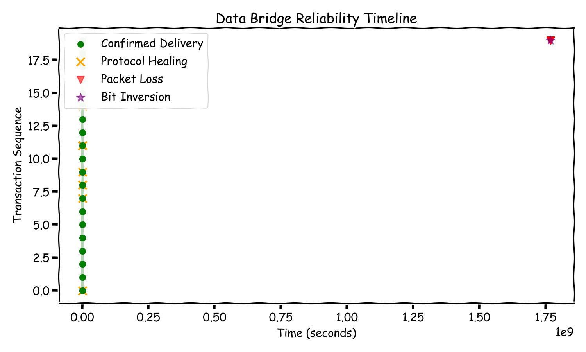

# Test Record - ISO 13485 Compliance
**Project:** Data Bridge Serial Protocol
**Date:** 2026-01-07T23:05:53.274226
**Tester:** Automated Runner

## 1. Scope
Verification of the reliable serial protocol implementation (Class C Medical Device component).

## 2. Test Environment
*   **OS:** darwin
*   **Build Artifacts:** `/Users/satyamtiwary/Documents/Python-Things/data-bridge/build/tests/reliability_test`
*   **Test Driver:** `/Users/satyamtiwary/Documents/Python-Things/data-bridge/tests/verification_suite.py`

## 3. Reliability Visualization


## 4. Test Cases & Results

| Test ID | Condition | Items | Result | Verification |
| :--- | :--- | :--- | :--- | :--- |
| T-001 | Drop=0.0%, Corrupt=0.0% | 20 | **PASS** | Data Integrity confirmed via CRC32 |
| T-002 | Drop=5.0%, Corrupt=1.0% | 20 | **PASS** | Data Integrity confirmed via CRC32 |
| T-003 | Drop=10.0%, Corrupt=2.0% | 20 | **PASS** | Data Integrity confirmed via CRC32 |

## 5. Conclusion
**Overall Status:** PASS

The software HAS demonstrated compliance with reliability requirements.

## 4. Execution Logs

### T-001 Details
### Sender Log
```
[23:05:17.076] [SENDER] Starting stress test with 20 items...
[23:05:17.077] [SENDER] Sending SYN...
[23:05:17.177] [SENDER] Rx Type: 32
[23:05:17.177] [SENDER] Handshake Complete!
[23:05:17.177] [SENDER] Sending Item 0 Frag 0/1
[SENDER] Item 0 Verified.
[23:05:17.177] [SENDER] Sending Item 1 Frag 0/2
[23:05:17.177] [SENDER] Sending Item 1 Frag 1/2
[SENDER] Item 1 Verified.
[23:05:17.177] [SENDER] Sending Item 2 Frag 0/1
[SENDER] Item 2 Verified.
[23:05:17.178] [SENDER] Sending Item 3 Frag 0/3
[23:05:17.178] [SENDER] Sending Item 3 Frag 1/3
[23:05:17.178] [SENDER] Sending Item 3 Frag 2/3
[SENDER] Item 3 Verified.
[23:05:17.178] [SENDER] Sending Item 4 Frag 0/4
[23:05:17.178] [SENDER] Sending Item 4 Frag 1/4
[23:05:17.178] [SENDER] Sending Item 4 Frag 2/4
[23:05:17.178] [SENDER] Sending Item 4 Frag 3/4
[SENDER] Item 4 Verified.
[23:05:17.178] [SENDER] Sending Item 5 Frag 0/3
[23:05:17.178] [SENDER] Sending Item 5 Frag 1/3
[23:05:17.178] [SENDER] Sending Item 5 Frag 2/3
[SENDER] Item 5 Verified.
[23:05:17.179] [SENDER] Sending Item 6 Frag 0/5
[23:05:17.179] [SENDER] Sending Item 6 Frag 1/5
[23:05:17.179] [SENDER] Sending Item 6 Frag 2/5
[23:05:17.179] [SENDER] Sending Item 6 Frag 3/5
[23:05:17.179] [SENDER] Sending Item 6 Frag 4/5
[SENDER] Item 6 Verified.
[23:05:17.179] [SENDER] Sending Item 7 Frag 0/4
[23:05:17.179] [SENDER] Sending Item 7 Frag 1/4
[23:05:17.179] [SENDER] Sending Item 7 Frag 2/4
[23:05:17.179] [SENDER] Sending Item 7 Frag 3/4
[SENDER] Item 7 Verified.
[23:05:17.179] [SENDER] Sending Item 8 Frag 0/2
[23:05:17.179] [SENDER] Sending Item 8 Frag 1/2
[SENDER] Item 8 Verified.
[23:05:17.179] [SENDER] Sending Item 9 Frag 0/2
[23:05:17.180] [SENDER] Sending Item 9 Frag 1/2
[SENDER] Item 9 Verified.
[23:05:17.180] [SENDER] Sending Item 10 Frag 0/2
[23:05:17.180] [SENDER] Sending Item 10 Frag 1/2
[SENDER] Item 10 Verified.
[23:05:17.180] [SENDER] Sending Item 11 Frag 0/4
[23:05:17.180] [SENDER] Sending Item 11 Frag 1/4
[23:05:17.180] [SENDER] Sending Item 11 Frag 2/4
[23:05:17.180] [SENDER] Sending Item 11 Frag 3/4
[SENDER] Item 11 Verified.
[23:05:17.180] [SENDER] Sending Item 12 Frag 0/1
[SENDER] Item 12 Verified.
[23:05:17.180] [SENDER] Sending Item 13 Frag 0/3
[23:05:17.180] [SENDER] Sending Item 13 Frag 1/3
[23:05:17.180] [SENDER] Sending Item 13 Frag 2/3
[SENDER] Item 13 Verified.
[23:05:17.180] [SENDER] Sending Item 14 Frag 0/4
[23:05:17.181] [SENDER] Sending Item 14 Frag 1/4
[23:05:17.181] [SENDER] Sending Item 14 Frag 2/4
[23:05:17.181] [SENDER] Sending Item 14 Frag 3/4
[SENDER] Item 14 Verified.
[23:05:17.181] [SENDER] Sending Item 15 Frag 0/1
[SENDER] Item 15 Verified.
[23:05:17.181] [SENDER] Sending Item 16 Frag 0/2
[23:05:17.181] [SENDER] Sending Item 16 Frag 1/2
[SENDER] Item 16 Verified.
[23:05:17.181] [SENDER] Sending Item 17 Frag 0/4
[23:05:17.181] [SENDER] Sending Item 17 Frag 1/4
[23:05:17.181] [SENDER] Sending Item 17 Frag 2/4
[23:05:17.181] [SENDER] Sending Item 17 Frag 3/4
[SENDER] Item 17 Verified.
[23:05:17.181] [SENDER] Sending Item 18 Frag 0/4
[23:05:17.181] [SENDER] Sending Item 18 Frag 1/4
[23:05:17.182] [SENDER] Sending Item 18 Frag 2/4
[23:05:17.182] [SENDER] Sending Item 18 Frag 3/4
[SENDER] Item 18 Verified.
[23:05:17.182] [SENDER] Sending Item 19 Frag 0/3
[23:05:17.182] [SENDER] Sending Item 19 Frag 1/3
[23:05:17.182] [SENDER] Sending Item 19 Frag 2/3
[SENDER] Item 19 Verified.
[SENDER] TEST COMPLETE - All items transferred successfully.

```
### Receiver Log
```
[23:05:17.076] [RECEIVER] Listening...
[RECEIVER] Read 24 bytes
[RECEIVER] Synqed.
[RECEIVER] Read 106 bytes
[23:05:17.177] [RECEIVER] Completed Item 0 (Total: 1)
[RECEIVER] Read 142 bytes
[RECEIVER] Read 25 bytes
[23:05:17.177] [RECEIVER] Completed Item 1 (Total: 2)
[RECEIVER] Read 103 bytes
[23:05:17.178] [RECEIVER] Completed Item 2 (Total: 3)
[RECEIVER] Read 142 bytes
[RECEIVER] Read 142 bytes
[RECEIVER] Read 17 bytes
[23:05:17.178] [RECEIVER] Completed Item 3 (Total: 4)
[RECEIVER] Read 142 bytes
[RECEIVER] Read 142 bytes
[RECEIVER] Read 142 bytes
[RECEIVER] Read 77 bytes
[23:05:17.178] [RECEIVER] Completed Item 4 (Total: 5)
[RECEIVER] Read 142 bytes
[RECEIVER] Read 142 bytes
[RECEIVER] Read 95 bytes
[23:05:17.179] [RECEIVER] Completed Item 5 (Total: 6)
[RECEIVER] Read 142 bytes
[RECEIVER] Read 142 bytes
[RECEIVER] Read 142 bytes
[RECEIVER] Read 142 bytes
[RECEIVER] Read 17 bytes
[23:05:17.179] [RECEIVER] Completed Item 6 (Total: 7)
[RECEIVER] Read 142 bytes
[RECEIVER] Read 142 bytes
[RECEIVER] Read 142 bytes
[RECEIVER] Read 109 bytes
[23:05:17.179] [RECEIVER] Completed Item 7 (Total: 8)
[RECEIVER] Read 142 bytes
[RECEIVER] Read 54 bytes
[23:05:17.179] [RECEIVER] Completed Item 8 (Total: 9)
[RECEIVER] Read 142 bytes
[RECEIVER] Read 17 bytes
[23:05:17.180] [RECEIVER] Completed Item 9 (Total: 10)
[RECEIVER] Read 142 bytes
[RECEIVER] Read 35 bytes
[23:05:17.180] [RECEIVER] Completed Item 10 (Total: 11)
[RECEIVER] Read 142 bytes
[RECEIVER] Read 142 bytes
[RECEIVER] Read 142 bytes
[RECEIVER] Read 31 bytes
[23:05:17.180] [RECEIVER] Completed Item 11 (Total: 12)
[RECEIVER] Read 88 bytes
[23:05:17.180] [RECEIVER] Completed Item 12 (Total: 13)
[RECEIVER] Read 142 bytes
[RECEIVER] Read 142 bytes
[RECEIVER] Read 44 bytes
[23:05:17.180] [RECEIVER] Completed Item 13 (Total: 14)
[RECEIVER] Read 142 bytes
[RECEIVER] Read 142 bytes
[RECEIVER] Read 142 bytes
[RECEIVER] Read 142 bytes
[23:05:17.181] [RECEIVER] Completed Item 14 (Total: 15)
[RECEIVER] Read 106 bytes
[23:05:17.181] [RECEIVER] Completed Item 15 (Total: 16)
[RECEIVER] Read 142 bytes
[RECEIVER] Read 93 bytes
[23:05:17.181] [RECEIVER] Completed Item 16 (Total: 17)
[RECEIVER] Read 142 bytes
[RECEIVER] Read 142 bytes
[RECEIVER] Read 142 bytes
[RECEIVER] Read 99 bytes
[23:05:17.181] [RECEIVER] Completed Item 17 (Total: 18)
[RECEIVER] Read 142 bytes
[RECEIVER] Read 142 bytes
[RECEIVER] Read 142 bytes
[RECEIVER] Read 48 bytes
[23:05:17.182] [RECEIVER] Completed Item 18 (Total: 19)
[RECEIVER] Read 142 bytes
[RECEIVER] Read 142 bytes
[RECEIVER] Read 135 bytes
[23:05:17.182] [RECEIVER] Completed Item 19 (Total: 20)

```

### T-002 Details
### Sender Log
```
[23:05:18.218] [SENDER] Starting stress test with 20 items...
[23:05:18.218] [SENDER] Sending SYN...
[23:05:18.319] [SENDER] Rx Type: 32
[23:05:18.319] [SENDER] Handshake Complete!
[23:05:18.319] [SENDER] Sending Item 0 Frag 0/1
[SENDER] Item 0 Verified.
[23:05:18.320] [SENDER] Sending Item 1 Frag 0/2
[23:05:18.320] [SENDER] Sending Item 1 Frag 1/2
[SENDER] Item 1 Verified.
[23:05:18.320] [SENDER] Sending Item 2 Frag 0/1
[SENDER] Item 2 Verified.
[23:05:18.320] [SENDER] Sending Item 3 Frag 0/3
[23:05:18.320] [SENDER] Sending Item 3 Frag 1/3
[23:05:18.320] [SENDER] Sending Item 3 Frag 2/3
[SENDER] Item 3 Verified.
[23:05:18.321] [SENDER] Sending Item 4 Frag 0/4
[23:05:18.321] [SENDER] Sending Item 4 Frag 1/4
[23:05:18.321] [SENDER] Sending Item 4 Frag 2/4
[23:05:18.321] [SENDER] Sending Item 4 Frag 3/4
[SENDER] Item 4 Verified.
[23:05:18.321] [SENDER] Sending Item 5 Frag 0/3
[23:05:18.321] [SENDER] Sending Item 5 Frag 1/3
[23:05:18.321] [SENDER] Sending Item 5 Frag 2/3
[SENDER] Item 5 Verified.
[23:05:18.321] [SENDER] Sending Item 6 Frag 0/5
[23:05:18.322] [SENDER] Sending Item 6 Frag 1/5
[23:05:18.322] [SENDER] Sending Item 6 Frag 2/5
[23:05:18.322] [SENDER] Sending Item 6 Frag 3/5
[23:05:18.322] [SENDER] Sending Item 6 Frag 4/5
[SENDER] Item 6 Verified.
[23:05:18.322] [SENDER] Sending Item 7 Frag 0/4
[23:05:18.322] [SENDER] Sending Item 7 Frag 1/4
[23:05:18.322] [SENDER] Sending Item 7 Frag 2/4
[23:05:18.322] [SENDER] Sending Item 7 Frag 3/4
[SENDER] Item 7 Verified.
[23:05:18.323] [SENDER] Sending Item 8 Frag 0/2
[23:05:18.323] [SENDER] Sending Item 8 Frag 1/2
[SENDER] Timeout/NACK on Item 8 Frag 1. Retrying...
[SENDER] Item 8 Verified.
[23:05:20.340] [SENDER] Sending Item 9 Frag 0/2
[23:05:20.341] [SENDER] Sending Item 9 Frag 1/2
[SENDER] Item 9 Verified.
[23:05:20.341] [SENDER] Sending Item 10 Frag 0/2
[23:05:20.341] [SENDER] Sending Item 10 Frag 1/2
[SENDER] Item 10 Verified.
[23:05:20.341] [SENDER] Sending Item 11 Frag 0/4
[23:05:20.341] [SENDER] Sending Item 11 Frag 1/4
[SENDER] Timeout/NACK on Item 11 Frag 1. Retrying...
[23:05:22.360] [SENDER] Sending Item 11 Frag 2/4
[SENDER] Timeout/NACK on Item 11 Frag 2. Retrying...
[SENDER] Timeout/NACK on Item 11 Frag 2. Retrying...
[23:05:26.396] [SENDER] Sending Item 11 Frag 3/4
[SENDER] Item 11 Verified.
[23:05:26.397] [SENDER] Sending Item 12 Frag 0/1
[SENDER] Item 12 Verified.
[23:05:26.397] [SENDER] Sending Item 13 Frag 0/3
[23:05:26.397] [SENDER] Sending Item 13 Frag 1/3
[23:05:26.397] [SENDER] Sending Item 13 Frag 2/3
[SENDER] Item 13 Verified.
[23:05:26.397] [SENDER] Sending Item 14 Frag 0/4
[23:05:26.397] [SENDER] Sending Item 14 Frag 1/4
[23:05:26.397] [SENDER] Sending Item 14 Frag 2/4
[23:05:26.397] [SENDER] Sending Item 14 Frag 3/4
[SENDER] Item 14 Verified.
[23:05:26.397] [SENDER] Sending Item 15 Frag 0/1
[SENDER] Item 15 Verified.
[23:05:26.398] [SENDER] Sending Item 16 Frag 0/2
[23:05:26.398] [SENDER] Sending Item 16 Frag 1/2
[SENDER] Item 16 Verified.
[23:05:26.398] [SENDER] Sending Item 17 Frag 0/4
[23:05:26.398] [SENDER] Sending Item 17 Frag 1/4
[23:05:26.398] [SENDER] Sending Item 17 Frag 2/4
[23:05:26.398] [SENDER] Sending Item 17 Frag 3/4
[SENDER] Item 17 Verified.
[23:05:26.398] [SENDER] Sending Item 18 Frag 0/4
[23:05:26.398] [SENDER] Sending Item 18 Frag 1/4
[23:05:26.398] [SENDER] Sending Item 18 Frag 2/4
[23:05:26.398] [SENDER] Sending Item 18 Frag 3/4
[SENDER] Item 18 Verified.
[23:05:26.398] [SENDER] Sending Item 19 Frag 0/3
[SENDER] Timeout/NACK on Item 19 Frag 0. Retrying...
[23:05:28.417] [SENDER] Sending Item 19 Frag 1/3
[SENDER] Timeout/NACK on Item 19 Frag 1. Retrying...
[23:05:30.437] [SENDER] Sending Item 19 Frag 2/3
[SENDER] Item 19 Verified.
[SENDER] TEST COMPLETE - All items transferred successfully.

```
### Receiver Log
```
[23:05:18.217] [RECEIVER] Listening...
[RECEIVER] Read 24 bytes
[RECEIVER] Synqed.
[RECEIVER] Read 106 bytes
[23:05:18.320] [RECEIVER] Completed Item 0 (Total: 1)
[RECEIVER] Read 142 bytes
[RECEIVER] Read 25 bytes
[23:05:18.320] [RECEIVER] Completed Item 1 (Total: 2)
[RECEIVER] Read 103 bytes
[23:05:18.320] [RECEIVER] Completed Item 2 (Total: 3)
[RECEIVER] Read 142 bytes
[RECEIVER] Read 142 bytes
[RECEIVER] Read 17 bytes
[23:05:18.321] [RECEIVER] Completed Item 3 (Total: 4)
[RECEIVER] Read 142 bytes
[RECEIVER] Read 142 bytes
[RECEIVER] Read 142 bytes
[RECEIVER] Read 77 bytes
[23:05:18.321] [RECEIVER] Completed Item 4 (Total: 5)
[RECEIVER] Read 142 bytes
[RECEIVER] Read 142 bytes
[RECEIVER] Read 95 bytes
[23:05:18.321] [RECEIVER] Completed Item 5 (Total: 6)
[RECEIVER] Read 142 bytes
[RECEIVER] Read 142 bytes
[RECEIVER] Read 142 bytes
[RECEIVER] Read 142 bytes
[RECEIVER] Read 17 bytes
[23:05:18.322] [RECEIVER] Completed Item 6 (Total: 7)
[RECEIVER] Read 142 bytes
[RECEIVER] Read 142 bytes
[RECEIVER] Read 142 bytes
[RECEIVER] Read 109 bytes
[23:05:18.322] [RECEIVER] Completed Item 7 (Total: 8)
[RECEIVER] Read 142 bytes
[RECEIVER] Read 54 bytes
[23:05:18.323] [RECEIVER] Completed Item 8 (Total: 9)
[RECEIVER] Read 54 bytes
[RECEIVER] Read 142 bytes
[RECEIVER] Read 17 bytes
[23:05:20.341] [RECEIVER] Completed Item 9 (Total: 10)
[RECEIVER] Read 142 bytes
[RECEIVER] Read 35 bytes
[23:05:20.341] [RECEIVER] Completed Item 10 (Total: 11)
[RECEIVER] Read 142 bytes
[RECEIVER] Read 142 bytes
[RECEIVER] Read 142 bytes
[RECEIVER] Read 31 bytes
[23:05:26.397] [RECEIVER] Completed Item 11 (Total: 12)
[RECEIVER] Read 88 bytes
[23:05:26.397] [RECEIVER] Completed Item 12 (Total: 13)
[RECEIVER] Read 142 bytes
[RECEIVER] Read 142 bytes
[RECEIVER] Read 44 bytes
[23:05:26.397] [RECEIVER] Completed Item 13 (Total: 14)
[RECEIVER] Read 142 bytes
[RECEIVER] Read 142 bytes
[RECEIVER] Read 142 bytes
[RECEIVER] Read 142 bytes
[23:05:26.397] [RECEIVER] Completed Item 14 (Total: 15)
[RECEIVER] Read 106 bytes
[23:05:26.397] [RECEIVER] Completed Item 15 (Total: 16)
[RECEIVER] Read 142 bytes
[RECEIVER] Read 93 bytes
[23:05:26.398] [RECEIVER] Completed Item 16 (Total: 17)
[RECEIVER] Read 142 bytes
[RECEIVER] Read 142 bytes
[RECEIVER] Read 142 bytes
[RECEIVER] Read 99 bytes
[23:05:26.398] [RECEIVER] Completed Item 17 (Total: 18)
[RECEIVER] Read 142 bytes
[RECEIVER] Read 142 bytes
[RECEIVER] Read 142 bytes
[RECEIVER] Read 48 bytes
[23:05:26.398] [RECEIVER] Completed Item 18 (Total: 19)
[RECEIVER] Read 142 bytes
[RECEIVER] Read 142 bytes
[RECEIVER] Read 135 bytes
[23:05:30.437] [RECEIVER] Completed Item 19 (Total: 20)

```

### T-003 Details
### Sender Log
```
[23:05:31.474] [SENDER] Starting stress test with 20 items...
[23:05:31.475] [SENDER] Sending SYN...
[23:05:31.576] [SENDER] Rx Type: 32
[23:05:31.576] [SENDER] Handshake Complete!
[23:05:31.576] [SENDER] Sending Item 0 Frag 0/1
[SENDER] Timeout/NACK on Item 0 Frag 0. Retrying...
[SENDER] Item 0 Verified.
[23:05:33.592] [SENDER] Sending Item 1 Frag 0/2
[23:05:33.592] [SENDER] Sending Item 1 Frag 1/2
[SENDER] Item 1 Verified.
[23:05:33.592] [SENDER] Sending Item 2 Frag 0/1
[SENDER] Item 2 Verified.
[23:05:33.592] [SENDER] Sending Item 3 Frag 0/3
[23:05:33.592] [SENDER] Sending Item 3 Frag 1/3
[23:05:33.592] [SENDER] Sending Item 3 Frag 2/3
[SENDER] Item 3 Verified.
[23:05:33.593] [SENDER] Sending Item 4 Frag 0/4
[23:05:33.593] [SENDER] Sending Item 4 Frag 1/4
[23:05:33.593] [SENDER] Sending Item 4 Frag 2/4
[23:05:33.593] [SENDER] Sending Item 4 Frag 3/4
[SENDER] Item 4 Verified.
[23:05:33.593] [SENDER] Sending Item 5 Frag 0/3
[23:05:33.593] [SENDER] Sending Item 5 Frag 1/3
[23:05:33.593] [SENDER] Sending Item 5 Frag 2/3
[SENDER] Item 5 Verified.
[23:05:33.593] [SENDER] Sending Item 6 Frag 0/5
[23:05:33.593] [SENDER] Sending Item 6 Frag 1/5
[23:05:33.593] [SENDER] Sending Item 6 Frag 2/5
[23:05:33.593] [SENDER] Sending Item 6 Frag 3/5
[23:05:33.593] [SENDER] Sending Item 6 Frag 4/5
[SENDER] Item 6 Verified.
[23:05:33.594] [SENDER] Sending Item 7 Frag 0/4
[23:05:33.594] [SENDER] Sending Item 7 Frag 1/4
[23:05:33.594] [SENDER] Sending Item 7 Frag 2/4
[SENDER] Timeout/NACK on Item 7 Frag 2. Retrying...
[23:05:35.611] [SENDER] Sending Item 7 Frag 3/4
[SENDER] Item 7 Verified.
[23:05:35.612] [SENDER] Sending Item 8 Frag 0/2
[23:05:35.612] [SENDER] Sending Item 8 Frag 1/2
[SENDER] Timeout/NACK on Item 8 Frag 1. Retrying...
[SENDER] Item 8 Verified.
[23:05:37.629] [SENDER] Sending Item 9 Frag 0/2
[SENDER] Timeout/NACK on Item 9 Frag 0. Retrying...
[23:05:39.645] [SENDER] Sending Item 9 Frag 1/2
[SENDER] Item 9 Verified.
[23:05:39.645] [SENDER] Sending Item 10 Frag 0/2
[23:05:39.646] [SENDER] Sending Item 10 Frag 1/2
[SENDER] Item 10 Verified.
[23:05:39.646] [SENDER] Sending Item 11 Frag 0/4
[SENDER] Timeout/NACK on Item 11 Frag 0. Retrying...
[SENDER] Timeout/NACK on Item 11 Frag 0. Retrying...
[23:05:43.675] [SENDER] Sending Item 11 Frag 1/4
[23:05:43.675] [SENDER] Sending Item 11 Frag 2/4
[23:05:43.675] [SENDER] Sending Item 11 Frag 3/4
[SENDER] Item 11 Verified.
[23:05:43.675] [SENDER] Sending Item 12 Frag 0/1
[SENDER] Item 12 Verified.
[23:05:43.676] [SENDER] Sending Item 13 Frag 0/3
[23:05:43.676] [SENDER] Sending Item 13 Frag 1/3
[23:05:43.676] [SENDER] Sending Item 13 Frag 2/3
[SENDER] Item 13 Verified.
[23:05:43.676] [SENDER] Sending Item 14 Frag 0/4
[23:05:43.676] [SENDER] Sending Item 14 Frag 1/4
[23:05:43.676] [SENDER] Sending Item 14 Frag 2/4
[23:05:43.676] [SENDER] Sending Item 14 Frag 3/4
[SENDER] Timeout/NACK on Item 14 Frag 3. Retrying...
[SENDER] Item 14 Verified.
[23:05:45.695] [SENDER] Sending Item 15 Frag 0/1
[SENDER] Item 15 Verified.
[23:05:45.696] [SENDER] Sending Item 16 Frag 0/2
[23:05:45.696] [SENDER] Sending Item 16 Frag 1/2
[SENDER] Item 16 Verified.
[23:05:45.696] [SENDER] Sending Item 17 Frag 0/4
[23:05:45.696] [SENDER] Sending Item 17 Frag 1/4
[23:05:45.696] [SENDER] Sending Item 17 Frag 2/4
[23:05:45.696] [SENDER] Sending Item 17 Frag 3/4
[SENDER] Item 17 Verified.
[23:05:45.696] [SENDER] Sending Item 18 Frag 0/4
[23:05:45.696] [SENDER] Sending Item 18 Frag 1/4
[SENDER] Timeout/NACK on Item 18 Frag 1. Retrying...
[SENDER] Timeout/NACK on Item 18 Frag 1. Retrying...
[23:05:49.731] [SENDER] Sending Item 18 Frag 2/4
[SENDER] Timeout/NACK on Item 18 Frag 2. Retrying...
[23:05:51.748] [SENDER] Sending Item 18 Frag 3/4
[SENDER] Item 18 Verified.
[23:05:51.749] [SENDER] Sending Item 19 Frag 0/3
[23:05:51.749] [SENDER] Sending Item 19 Frag 1/3
[23:05:51.749] [SENDER] Sending Item 19 Frag 2/3
[SENDER] Item 19 Verified.
[SENDER] TEST COMPLETE - All items transferred successfully.

```
### Receiver Log
```
[23:05:31.472] [RECEIVER] Listening...
[RECEIVER] Read 24 bytes
[RECEIVER] Synqed.
[RECEIVER] Read 106 bytes
[23:05:33.592] [RECEIVER] Completed Item 0 (Total: 1)
[RECEIVER] Read 142 bytes
[RECEIVER] Read 25 bytes
[23:05:33.592] [RECEIVER] Completed Item 1 (Total: 2)
[RECEIVER] Read 103 bytes
[23:05:33.592] [RECEIVER] Completed Item 2 (Total: 3)
[RECEIVER] Read 142 bytes
[RECEIVER] Read 142 bytes
[RECEIVER] Read 17 bytes
[23:05:33.592] [RECEIVER] Completed Item 3 (Total: 4)
[RECEIVER] Read 142 bytes
[RECEIVER] Read 142 bytes
[RECEIVER] Read 142 bytes
[RECEIVER] Read 77 bytes
[23:05:33.593] [RECEIVER] Completed Item 4 (Total: 5)
[RECEIVER] Read 142 bytes
[RECEIVER] Read 142 bytes
[RECEIVER] Read 95 bytes
[23:05:33.593] [RECEIVER] Completed Item 5 (Total: 6)
[RECEIVER] Read 142 bytes
[RECEIVER] Read 142 bytes
[RECEIVER] Read 142 bytes
[RECEIVER] Read 142 bytes
[RECEIVER] Read 17 bytes
[23:05:33.594] [RECEIVER] Completed Item 6 (Total: 7)
[RECEIVER] Read 142 bytes
[RECEIVER] Read 142 bytes
[RECEIVER] Read 142 bytes
[RECEIVER] Read 142 bytes
[RECEIVER] Read 109 bytes
[23:05:35.612] [RECEIVER] Completed Item 7 (Total: 8)
[RECEIVER] Read 142 bytes
[RECEIVER] Read 54 bytes
[23:05:37.629] [RECEIVER] Completed Item 8 (Total: 9)
[RECEIVER] Read 142 bytes
[RECEIVER] Read 17 bytes
[23:05:39.645] [RECEIVER] Completed Item 9 (Total: 10)
[RECEIVER] Read 142 bytes
[RECEIVER] Read 35 bytes
[23:05:39.646] [RECEIVER] Completed Item 10 (Total: 11)
[RECEIVER] Read 142 bytes
[RECEIVER] Read 142 bytes
[RECEIVER] Read 142 bytes
[RECEIVER] Read 142 bytes
[RECEIVER] Read 31 bytes
[23:05:43.675] [RECEIVER] Completed Item 11 (Total: 12)
[RECEIVER] Read 88 bytes
[23:05:43.676] [RECEIVER] Completed Item 12 (Total: 13)
[RECEIVER] Read 142 bytes
[RECEIVER] Read 142 bytes
[RECEIVER] Read 44 bytes
[23:05:43.676] [RECEIVER] Completed Item 13 (Total: 14)
[RECEIVER] Read 142 bytes
[RECEIVER] Read 142 bytes
[RECEIVER] Read 142 bytes
[RECEIVER] Read 142 bytes
[23:05:45.695] [RECEIVER] Completed Item 14 (Total: 15)
[RECEIVER] Read 106 bytes
[23:05:45.695] [RECEIVER] Completed Item 15 (Total: 16)
[RECEIVER] Read 142 bytes
[RECEIVER] Read 93 bytes
[23:05:45.696] [RECEIVER] Completed Item 16 (Total: 17)
[RECEIVER] Read 142 bytes
[RECEIVER] Read 142 bytes
[RECEIVER] Read 142 bytes
[RECEIVER] Read 99 bytes
[23:05:45.696] [RECEIVER] Completed Item 17 (Total: 18)
[RECEIVER] Read 142 bytes
[RECEIVER] Read 142 bytes
[RECEIVER] Read 142 bytes
[RECEIVER] Read 142 bytes
[RECEIVER] Read 48 bytes
[23:05:51.749] [RECEIVER] Completed Item 18 (Total: 19)
[RECEIVER] Read 142 bytes
[RECEIVER] Read 142 bytes
[RECEIVER] Read 135 bytes
[23:05:51.750] [RECEIVER] Completed Item 19 (Total: 20)

```
